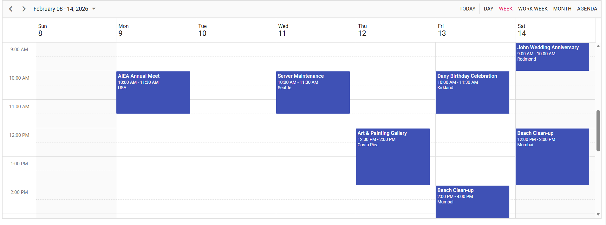

<!--
  howto.md
  A step-by-step guide to integrate EJ2 Angular Scheduler with CRUD using GraphQL Adaptor.
-->
# How to integrate EJ2 Angular Scheduler with CRUD using GraphQL Adaptor.

This repository contains a sample full-stack application demonstrating how to show events in Syncfusion Angular Scheduler component using GraphQL. The Angular frontend provides a responsive UI for viewing and managing calendar events.


## Prerequisites
- Node.js (>= 20.19)
- npm (>= 7.0)
- Angular CLI (== 17.0.0)

## Setup

### Cloning the repository
    
- Clone the repository to your local machine

### GraphQL Server setup

### Installation
1. Open a terminal and navigate to the GraphQLServer folder
    ```bash
    cd GraphQLServer
    ```
2. Install dependencies
    ```bash
    npm install
    ```

### Frontend Setup

### Installation

1. Open another terminal and navigate to the SchedulerApp folder
    ```bash
    cd SchedulerApp
    ```
2. Install the required packages
    ```bash
    npm install
    ```

### Running the Application
1. Open a terminal and navigate to GraphQLServer folder
      ```bash
    cd GraphQLServer
    ```
2. Start the GraphQL server:
    ```bash
    npm run dev
    ```
3. Server started running on `http://localhost:4400`
4. Open another terminal and Navigate to SchedulerApp folder
      ```bash
    cd SchedulerApp
    ```
5. Start the Schedule Frontend:
    ```bash
    npm start
    ```
6. Navigate to [`http://localhost:4200`](http://localhost:4200) in your browser.

7. You can perform CRUD operation on the events that will be reflected in the Scheduler.

## Output Preview

*Image illustrating the Syncfusion Angular Scheduler*

## Troubleshooting
- **npm install stuck or fails**: Delete node_modules + package-lock.json, restart system, and reinstall using npm install.
- **Karma/Jasmine version errors**: Install matched versions: karma@6.4.0, karma-jasmine@5.1.0, jasmine-core@5.1.0.